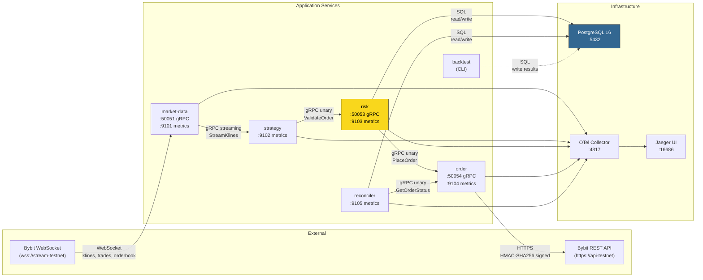
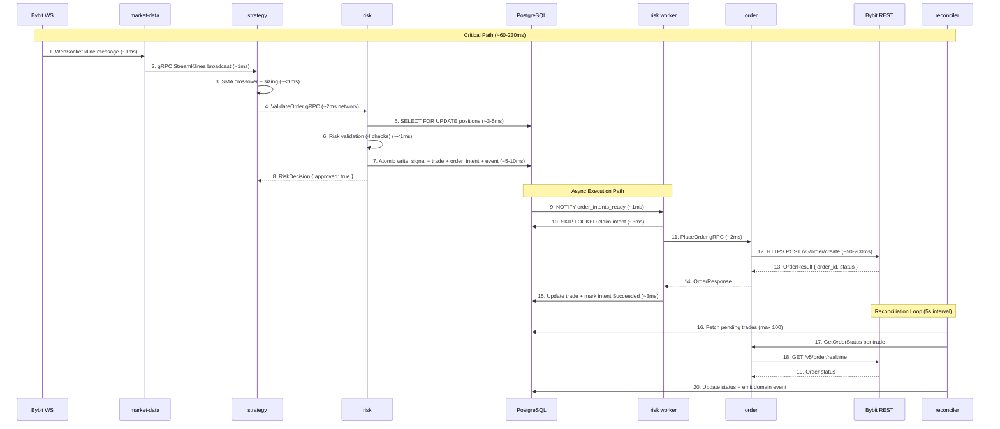

# Moria — System Design Document

## 1. System Overview

**Moria** is an algorithmic cryptocurrency trading engine that executes SMA crossover strategies on Bybit's perpetual futures market. Built in Rust with a microservices architecture, it prioritizes **correctness over speed** — every order passes through transactional risk validation before reaching the exchange.

**Key numbers**: 6 services, 1 PostgreSQL database, 4 gRPC service definitions, 7 tables, ~60–230ms signal-to-order latency.

**Why microservices?** Strategy logic, risk management, and order execution have fundamentally different failure modes and change velocities. A bug in signal generation should never bypass risk limits. An exchange API outage should never corrupt position state. Separating these concerns into independent processes with a shared audit log (PostgreSQL) provides both safety and auditability — critical properties for a system that moves real money.

## 2. Architecture Diagrams

### 2a. Service Topology



### 2b. Request Lifecycle — Kline to Order Fill



## 3. Component Deep Dives

### 3a. market-data

| | |
|---|---|
| **Responsibility** | Ingest real-time OHLCV data from Bybit WebSocket, fan-out to gRPC subscribers |
| **Port** | 50051 (gRPC), 9101 (Prometheus) |
| **Key files** | `crates/market-data/src/bybit_ws.rs`, `server.rs` |

**API Surface**:
- `StreamKlines(StreamRequest) → stream Kline` — server-streaming gRPC
- `StreamTrades(StreamRequest) → stream Trade`
- `StreamOrderbook(StreamRequest) → stream OrderbookSnapshot`

**Design Decisions**:
- **Tokio broadcast channels** for fan-out: `broadcast::Sender<Kline>`, one per data type. Multiple gRPC clients subscribe independently.
- **Lagged subscribers are dropped, not blocked**: Market data is perishable. If a subscriber can't keep up, it misses data rather than applying backpressure to the WebSocket ingestion loop. This prevents a slow consumer from stalling the entire pipeline.
- **Exponential backoff reconnect**: 1s base, doubles up to 60s cap. Attempt counter resets on successful connection.
- **Bidirectional ping/pong**: 20s interval to keep the Bybit WebSocket alive.

**Failure Behavior**:
- WS disconnect → automatic reconnect with backoff, subscribers see a gap in data
- All subscribers disconnect → broadcast continues (no-op sends), data discarded
- Service crash → strategy loses its kline stream, must reconnect and re-bootstrap

### 3b. strategy

| | |
|---|---|
| **Responsibility** | Generate trading signals from SMA crossover, dispatch to risk service |
| **Port** | 9102 (Prometheus) |
| **Key files** | `crates/strategy/src/engine.rs`, `sma.rs` |

**Design Decisions**:
- **Historical bootstrap on startup**: Fetches `long_period` historical klines from Bybit REST API to avoid a cold-start blind period where the SMA has insufficient data. Without this, the strategy would emit no signals for the first 30+ candles.
- **Confirmed candles only**: `if !kline.confirm { continue; }` — only acts on closed (finalized) candles to avoid whipsawing on partial data.
- **Volatility-adjusted position sizing**: `sized_qty()` targets a fixed dollar risk per trade based on rolling volatility (20-period). Clamps to 0.25x–3.0x base quantity to prevent extreme sizing.
- **Bounded signal dispatch**: Semaphore-controlled concurrency (`signal_max_inflight`, default 16) prevents signal storms from overwhelming the risk service. `mpsc::channel` with configurable capacity adds backpressure.
- **Signal retry with jitter**: 3 attempts, exponential backoff (250ms, 500ms, 1000ms) with deterministic jitter derived from signal UUID.
- **Idempotent signal IDs**: Each signal gets a `Uuid::new_v4()` before first delivery attempt; retries reuse the same ID, enabling safe deduplication in risk service.

**Failure Behavior**:
- Risk service unavailable → signals retry 3x then are dropped (logged + metric)
- Market-data stream drops → reconnect loop, re-bootstrap historical data
- Service crash → no signals emitted (safe — system does nothing rather than something wrong)

### 3c. risk (Critical Path)

| | |
|---|---|
| **Responsibility** | Validate orders against risk limits, manage position state, enqueue execution |
| **Port** | 50053 (gRPC), 9103 (Prometheus) |
| **Key files** | `crates/risk/src/server.rs`, `validator.rs`, `db.rs`, `worker.rs` |

**API Surface**:
- `ValidateOrder(OrderRequest) → RiskDecision` — synchronous risk gate

**Four Risk Checks** (all evaluated against locked state):

| Check | Rule | Prevents |
|-------|------|----------|
| Position size | `\|new_position\| ≤ max_position_size` | Excessive directional exposure |
| Daily loss | `\|daily_pnl\| ≤ max_daily_loss` (includes unrealized) | Runaway daily losses |
| Portfolio notional | `total_notional + new_notional ≤ max_portfolio_notional` | Over-leveraging |
| Drawdown circuit breaker | `peak_pnl - current_pnl ≤ max_drawdown` | Catastrophic drawdown from peak |

**Concurrency Control** (TOCTOU prevention):
```
1. Idempotency check:  SELECT approved FROM signals WHERE id = $signal_id
2. Row-level lock:     SELECT ... FROM positions WHERE symbol = $1 FOR UPDATE
3. Advisory lock:      pg_advisory_xact_lock(hashtext($symbol))  -- for new symbols
4. Snapshot state:     Read position + daily_pnl + portfolio_notional + peak_pnl
5. Validate:           4 risk checks against locked snapshot
6. Atomic persist:     INSERT signal + INSERT trade + INSERT order_intent + INSERT domain_event
7. Notify worker:      pg_notify('order_intents_ready', 'ready')
8. Commit transaction
```

The advisory lock handles the edge case where two concurrent signals try to create a position for a symbol that doesn't exist yet — without it, both would see `positions` as empty and both could insert, violating uniqueness.

**Order Execution Outbox** (`worker.rs`):
- Background worker polls `order_intents` table for `Pending`/`Retry` status
- **SKIP LOCKED** claim pattern prevents multiple workers from claiming the same intent
- Event-driven wakeup via PostgreSQL `NOTIFY/LISTEN` (fallback: 5-minute polling)
- Exponential retry: `2^attempts` seconds, capped at 256s, max 8 attempts before `Failed`
- Idempotent trade upsert: `ON CONFLICT (signal_id) DO UPDATE`

**Why the outbox pattern?** Decouples the fast, synchronous risk decision from the slow, unreliable exchange API call. If the risk service crashes after approving an order but before submitting it, the order_intent row survives in the database and will be picked up on restart.

**Failure Behavior**:
- Service crash after commit → order_intent persists, worker retries on restart
- Service crash before commit → transaction rolled back, no side effects
- Order service unavailable → worker retries with backoff, intent stays in `Retry`
- PostgreSQL down → gRPC returns error, strategy retries the signal

### 3d. order

| | |
|---|---|
| **Responsibility** | Translate gRPC order requests to Bybit REST API calls |
| **Port** | 50054 (gRPC), 9104 (Prometheus) |
| **Key files** | `crates/order/src/server.rs`, `bybit_rest.rs` |

**API Surface**:
- `PlaceOrder(OrderRequest) → OrderResponse`
- `GetOrderStatus(OrderStatusRequest) → OrderStatusResponse`

**Design Decisions**:
- **Stateless translator**: No local state, no database access. Pure pass-through that handles authentication and protocol translation.
- **HMAC-SHA256 signing**: `signature = HMAC(api_secret, timestamp + api_key + recv_window + body)`. Headers: `X-BAPI-API-KEY`, `X-BAPI-SIGN`, `X-BAPI-TIMESTAMP`, `X-BAPI-RECV-WINDOW` (5000ms).
- **15s HTTP timeout**: Generous enough for Bybit latency spikes, short enough to fail fast.
- **Market orders use IOC** (Immediate-Or-Cancel), limit orders use GTC (Good-Till-Cancelled).

**Failure Behavior**:
- Bybit returns error → mapped to `Rejected` status with error message
- HTTP timeout → error propagated to caller (risk worker will retry)
- Service crash → risk worker retries the order_intent

### 3e. reconciler

| | |
|---|---|
| **Responsibility** | Poll for order status updates, reconcile trade states in database |
| **Port** | 9105 (Prometheus only — no gRPC server) |
| **Key files** | `crates/reconciler/src/main.rs` |

**Design Decisions**:
- **5-second polling interval**: Balances latency against Bybit API rate limits.
- **Batch processing**: Fetches up to 100 pending trades per tick (`status IN ('Submitted', 'New', 'PartiallyFilled')`).
- **Domain events on transitions**: Every status change produces an `OrderStatusReconciled` event in `domain_events`, creating a complete audit trail.
- **Rejection annotation**: When an order is `Rejected` by the exchange, the reconciler writes the reason back to the `signals.reject_reason` column.

**Failure Behavior**:
- Order service unavailable → tick fails, retries next cycle (5s)
- Status lookup timeout → individual trade skipped, retried next tick
- Service crash → no state corruption (read-heavy, idempotent updates)

### 3f. backtest (CLI)

| | |
|---|---|
| **Responsibility** | Run SMA crossover strategy against historical CSV data |
| **Key files** | `crates/backtest/src/main.rs` |

**Design Decisions**:
- **Shares live position math**: Reuses `moria_common::position::apply_fill()` and `sized_qty()` to ensure backtest results match live trading behavior.
- **Computes standard metrics**: `total_return_pct`, `max_drawdown_pct`, `sharpe_ratio`, `trades_count`, `win_rate`.
- **Optional persistence**: Writes results to `backtest_runs` table if `DATABASE_URL` is provided.
- **Fee modeling**: Configurable `fee_bps` applied to each trade.

## 4. Data Model

### 4a. Table Layout

| Table | PK | Purpose |
|-------|-----|---------|
| `signals` | `id` (UUID) | Every signal generated by strategy, with approval status |
| `trades` | `id` (UUID), FK `signal_id` (UNIQUE) | Exchange trade records, 1:1 with approved signals |
| `positions` | `symbol` (TEXT) | Materialized position state — O(1) risk check lookups |
| `daily_equity` | `date` (DATE) | Peak PnL tracking for drawdown circuit breaker |
| `order_intents` | `id` (UUID), FK `signal_id` (UNIQUE) | Transactional outbox for order execution |
| `domain_events` | `id` (UUID) | Append-only audit trail of all system events |
| `backtest_runs` | `id` (UUID) | Historical backtest results and parameters |

### 4b. Schema Detail

```sql
-- Core signal tracking
signals (
    id              UUID PRIMARY KEY,
    symbol          TEXT NOT NULL,
    side            TEXT NOT NULL,          -- 'Buy' | 'Sell'
    order_type      TEXT NOT NULL,          -- 'Market' | 'Limit'
    price           NUMERIC(20,8) NOT NULL,
    qty             NUMERIC(20,8) NOT NULL,
    strategy        TEXT DEFAULT 'sma_crossover',
    approved        BOOLEAN,
    reject_reason   TEXT,
    created_at      TIMESTAMPTZ DEFAULT now()
);

-- Exchange trade records (1:1 with approved signals)
trades (
    id              UUID PRIMARY KEY,
    signal_id       UUID UNIQUE REFERENCES signals(id),
    order_id        TEXT,
    symbol          TEXT NOT NULL,
    side            TEXT NOT NULL,
    price           NUMERIC(20,8),
    qty             NUMERIC(20,8),
    status          TEXT NOT NULL,          -- 'Submitted' | 'Filled' | 'Rejected' | 'New' | 'PartiallyFilled' | 'Uncertain'
    realized_pnl    NUMERIC(20,8),
    created_at      TIMESTAMPTZ DEFAULT now()
);

-- Materialized position state (O(1) lookup for risk checks)
positions (
    symbol          TEXT PRIMARY KEY,
    qty             NUMERIC(20,8) NOT NULL, -- Signed: positive = long, negative = short
    avg_entry_price NUMERIC(20,8) NOT NULL,
    updated_at      TIMESTAMPTZ DEFAULT now()
);

-- Drawdown tracking (high-water mark per day)
daily_equity (
    date            DATE PRIMARY KEY,
    peak_pnl        NUMERIC(20,8) NOT NULL,
    updated_at      TIMESTAMPTZ DEFAULT now()
);

-- Transactional outbox for reliable order execution
order_intents (
    id              UUID PRIMARY KEY,
    signal_id       UUID UNIQUE REFERENCES signals(id),
    symbol          TEXT NOT NULL,
    side            TEXT NOT NULL,
    order_type      TEXT NOT NULL,
    price           NUMERIC(20,8),
    qty             NUMERIC(20,8),
    status          TEXT NOT NULL,          -- 'Pending' | 'InProgress' | 'Retry' | 'Succeeded' | 'Failed'
    attempts        INTEGER DEFAULT 0,
    next_attempt_at TIMESTAMPTZ,
    last_error      TEXT,
    created_at      TIMESTAMPTZ DEFAULT now(),
    updated_at      TIMESTAMPTZ DEFAULT now()
);

-- Append-only audit trail
domain_events (
    id              UUID PRIMARY KEY,
    producer        TEXT NOT NULL,          -- Service name
    event_type      TEXT NOT NULL,          -- 'RiskOrderAccepted', 'OrderExecutionSubmitted', etc.
    aggregate_id    TEXT NOT NULL,          -- signal_id
    payload         JSONB NOT NULL,
    created_at      TIMESTAMPTZ DEFAULT now()
);

-- Backtest results
backtest_runs (
    id                UUID PRIMARY KEY,
    strategy          TEXT NOT NULL,
    symbol            TEXT NOT NULL,
    params            JSONB NOT NULL,
    total_return_pct  NUMERIC(20,8),
    max_drawdown_pct  NUMERIC(20,8),
    sharpe_ratio      NUMERIC(20,8),
    trades_count      INTEGER,
    win_rate          NUMERIC(20,8),
    created_at        TIMESTAMPTZ DEFAULT now()
);
```

### 4c. Key Indexes

| Index | Columns | Purpose |
|-------|---------|---------|
| `idx_trades_symbol_date_status` | `(symbol, created_at, status)` | Daily PnL aggregation for risk checks |
| `idx_trades_signal_id` | `(signal_id)` UNIQUE | 1:1 signal-trade lookup + idempotency |
| `idx_signals_created_at` | `(created_at)` | Chronological signal queries |
| `idx_order_intents_status_next_attempt` | `(status, next_attempt_at, created_at)` | Worker outbox polling with SKIP LOCKED |
| `idx_trades_status_created_at` | `(status, created_at)` | Reconciler pending trade fetch |
| `idx_domain_events_created_at` | `(created_at)` | Event log chronological queries |
| `idx_domain_events_event_type` | `(event_type, created_at)` | Event type filtering |
| `idx_backtest_runs_created_at` | `(created_at DESC)` | Latest backtest results |

### 4d. Why Each Table Exists

- **`positions`** = materialized view for O(1) risk checks. Without it, every risk check would need `SUM(qty)` over all trades — O(n) and requiring a table lock for consistency.
- **`daily_equity`** = high-water mark tracking for the drawdown circuit breaker. Tracks `peak_pnl` per day, updated conditionally (only increases).
- **`order_intents`** = transactional outbox. Decouples the synchronous risk decision from asynchronous order execution. Survives service crashes.
- **`domain_events`** = append-only audit trail. Every meaningful state change is recorded with producer, event type, and JSONB payload. Enables debugging, compliance, and future event-driven features.

## 5. Key Design Patterns

### 5a. Broadcast Channels (Fan-Out)

**Pattern**: Tokio `broadcast::Sender<T>` for market data distribution.

**Rationale**: Market data is inherently perishable — a kline from 2 seconds ago is stale. When a subscriber falls behind (broadcast buffer full), the system drops the lagged subscriber rather than buffering unboundedly or blocking the WebSocket ingestion loop. This is the correct trade-off for real-time market data: **availability over completeness**.

**Counter metric**: `market_data_stream_lagged_total{stream}` tracks how often this occurs.

### 5b. Order Intent Outbox (Crash Safety)

**Pattern**: Write an `order_intent` row in the same database transaction as the risk decision, then execute it asynchronously via a background worker.

**Rationale**: The alternative — calling the order service synchronously inside the risk transaction — creates a dangerous coupling. If the order service is slow or down, the risk transaction holds a row lock for seconds, blocking all concurrent risk checks for that symbol. With the outbox, the risk path remains fast (~10ms) regardless of exchange latency.

**Claim pattern**: `WITH candidate AS (SELECT ... FOR UPDATE SKIP LOCKED LIMIT 1) UPDATE ... FROM candidate RETURNING *` — safe for concurrent workers.

### 5c. Idempotent Signal Processing

**Pattern**: UUID-based signal deduplication at the risk service layer.

**Implementation**: Before acquiring locks, check `SELECT approved FROM signals WHERE id = $signal_id`. If found, return the cached decision. The `ON CONFLICT (signal_id) DO NOTHING` on `order_intents` provides a second safety net.

**Why needed**: Strategy retries failed signal deliveries with the same signal_id. Without deduplication, a network timeout could cause the same order to be submitted twice.

### 5d. Transactional Risk Locking (TOCTOU Prevention)

**Pattern**: `SELECT ... FOR UPDATE` on `positions` + `pg_advisory_xact_lock` for new symbols.

**Problem solved**: Without locking, two concurrent signals for the same symbol could both read `position = 0.5 BTC`, both approve `0.5 BTC` more (within the `1.0 BTC` limit), and result in a `1.5 BTC` position that exceeds the limit.

**Advisory lock necessity**: When no position row exists yet, `FOR UPDATE` has nothing to lock. The advisory lock on `hashtext(symbol)` serializes concurrent position creation.

### 5e. Decimal Arithmetic (`rust_decimal`)

**Pattern**: All financial values use `rust_decimal::Decimal` instead of `f64`.

**Rationale**: IEEE 754 floating-point arithmetic produces rounding errors that accumulate over thousands of trades. `0.1 + 0.2 ≠ 0.3` in f64. For a trading system, these errors compound into real P&L discrepancies. PostgreSQL's `NUMERIC(20,8)` stores the same precision on the database side.

### 5f. Domain Events (Audit Trail)

**Pattern**: Append-only `domain_events` table with `producer`, `event_type`, `aggregate_id`, and `JSONB payload`.

**Event types**: `RiskOrderAccepted`, `RiskOrderRejected`, `OrderExecutionSubmitted`, `OrderExecutionRetryScheduled`, `OrderStatusReconciled`.

**Value**: Complete forensic trail for post-incident analysis. Every order can be traced from signal generation through risk approval to exchange execution and final status.

## 6. Interview Deep-Dive Sections

### 6a. Scalability

| Component | Current Bottleneck | Scaling Approach |
|-----------|-------------------|------------------|
| market-data | Single WebSocket connection | Shard by symbol: one instance per symbol group |
| strategy | Single-threaded SMA computation | Already concurrent (semaphore-bounded dispatch); shard by symbol for true parallelism |
| risk | PostgreSQL row locks serialize per-symbol | Symbol partitioning: route symbols to separate risk instances with dedicated DB shards |
| order | Bybit rate limits (~10 req/s on testnet) | Multiple API key sets, round-robin across order service instances |
| reconciler | Sequential per-trade polling | Batch status API (if available), parallelize lookups |
| PostgreSQL | Single writer, row-level contention | Read replicas for analytics, write partitioning by symbol hash |

**Current capacity**: The system handles ~1-2 signals/second comfortably. The bottleneck is Bybit REST latency (50-200ms per order), not internal processing.

**10x scaling path**: Increase broadcast buffer sizes, add read replicas, parallelize reconciler lookups. No architectural changes needed.

**100x scaling path**: PostgreSQL row locks become contention points. Solution: partition the `positions` table by symbol, route each symbol to a dedicated risk instance. This maintains serializable consistency within each symbol while allowing cross-symbol parallelism.

### 6b. Fault Tolerance

| Failure Scenario | Impact | Mitigation |
|-----------------|--------|------------|
| market-data crash | Strategy loses kline stream | Auto-reconnect loop; strategy re-bootstraps historical data |
| strategy crash | No new signals generated | Safe failure — system does nothing rather than something wrong |
| risk crash (before commit) | Transaction rolled back | No side effects; strategy retries the signal |
| risk crash (after commit) | Order_intent persists in DB | Worker picks up on restart; outbox pattern guarantees delivery |
| order crash | Worker gets gRPC error | Worker retries with exponential backoff (max 8 attempts) |
| reconciler crash | Pending orders stay in 'Submitted' | Restart resumes polling; idempotent status updates |
| PostgreSQL crash | **All writes fail** (SPOF) | No built-in HA; requires external replication (Patroni/RDS) |
| Bybit WS disconnect | Market data gap | Exponential backoff reconnect (1s → 60s cap) |
| Bybit REST timeout | Order submission fails | Outbox worker retries; order_intent stays in Retry |
| Network partition (internal) | gRPC calls fail | Strategy retries signals; worker retries orders |

**Single Point of Failure**: PostgreSQL. Every service that writes data depends on it. Mitigation in production: managed database (RDS/Cloud SQL) with automated failover, or Patroni for self-hosted HA.

**Recovery guarantees**:
- **market-data**: Stateless, recovers by reconnecting
- **strategy**: Stateless (SMA state rebuilt from bootstrap), recovers by restarting
- **risk**: Stateful via PostgreSQL — outbox guarantees no approved orders are lost
- **order**: Stateless, pure translator
- **reconciler**: Idempotent — safe to restart at any point

### 6c. Consistency vs. Availability

| Path | Choice | Rationale |
|------|--------|-----------|
| Risk validation | **Consistency** (serialized locks) | A risk check that uses stale position data could approve an order that violates limits. Correctness is non-negotiable for financial systems. |
| Market data distribution | **Availability** (drop lagged subscribers) | Stale market data is worse than no market data. Better to skip and act on fresh data. |
| Order execution | **At-least-once** with idempotency | Orders must eventually be submitted (availability), but duplicate submissions are prevented by signal_id uniqueness (consistency). |
| Audit trail | **Strong consistency** (same transaction) | Domain events are written atomically with the state change they describe. No eventual consistency lag. |

**CAP analysis**: Within a single PostgreSQL instance, Moria operates as a **CP system** on the critical path (risk). It sacrifices availability (blocks concurrent risk checks for the same symbol) to maintain position consistency. The market data path is **AP** — always available, eventually consistent (subscribers may miss data).

### 6d. Latency Analysis

| Step | Operation | Estimated Latency |
|------|-----------|-------------------|
| 1 | Bybit WS → market-data (parse + broadcast) | ~1ms |
| 2 | market-data → strategy (gRPC stream) | ~1ms |
| 3 | SMA computation + signal sizing | <1ms |
| 4 | strategy → risk (gRPC unary) | ~2ms |
| 5 | SELECT FOR UPDATE position | ~3-5ms |
| 6 | Risk validation (4 checks) | <1ms |
| 7 | Atomic persist (4 INSERTs) | ~5-10ms |
| 8 | RiskDecision response | ~1ms |
| 9 | NOTIFY + worker wakeup | ~1-3ms |
| 10 | SKIP LOCKED claim | ~3ms |
| 11 | worker → order (gRPC) | ~2ms |
| 12 | **Bybit REST API call** | **~50-200ms** |
| **Total** | | **~60-230ms** |

**Key insight**: Internal latency is <30ms. The dominating factor is the Bybit REST API round-trip (50-200ms). Optimizing internal code yields marginal improvement. The real optimization lever is order API latency — potentially via WebSocket order submission (Bybit supports this for private connections).

### 6e. Stress Testing

**What breaks first**: The broadcast channel buffer fills up under high message rates, causing `strategy` to lag and miss klines. The `market_data_stream_lagged_total` metric signals this.

**How to test**:
- **Replay at high speed**: Feed historical klines at 100x real-time through the WebSocket handler
- **Synthetic signal flood**: Generate artificial signals directly to risk service, bypassing strategy
- **Chaos engineering**: Kill random services, verify recovery via domain events
- **Lock contention testing**: Send concurrent signals for the same symbol, verify no duplicate orders

**Scaling thresholds**:

| Volume | Bottleneck | Solution |
|--------|-----------|----------|
| 10x current | Broadcast buffer overflow | Increase buffer sizes (currently default Tokio broadcast capacity) |
| 50x current | Strategy dispatch queue full | Increase `signal_queue_capacity`, add more inflight permits |
| 100x current | PostgreSQL row lock contention | Shard positions table by symbol, dedicated risk instances |
| 1000x current | Single PostgreSQL write path | Per-symbol databases, eventual consistency for cross-symbol checks |

### 6f. Security

| Area | Current Implementation | Production Recommendation |
|------|----------------------|--------------------------|
| API key storage | Environment variables (`BYBIT_API_KEY`, `BYBIT_API_SECRET`) | Secrets manager (AWS Secrets Manager, Vault) |
| Inter-service auth | Shared token (`INTERNAL_SERVICE_TOKEN`) in gRPC metadata | mTLS with certificate rotation |
| Exchange API auth | HMAC-SHA256 signing with 5s receive window | Same, with IP whitelisting |
| Database credentials | Hardcoded in docker-compose | IAM-based auth (RDS IAM, Cloud SQL IAM) |
| Network security | No TLS between services | Service mesh (Istio/Linkerd) for mTLS |
| Rate limiting | None on risk endpoint | Token bucket per client/symbol |
| Input validation | gRPC schema validation + risk checks | Add additional sanitization layer |

**Known gaps**:
- No TLS on internal gRPC channels (plaintext between services)
- No rate limiting on the risk validation endpoint
- Shared token is a single secret — compromise affects all services
- No audit log for authentication failures

### 6g. Monitoring & Alerting

**Key Metrics** (actual from codebase):

| Metric | Type | Alert Condition |
|--------|------|-----------------|
| `risk_approved_total` | Counter | Rate drops to 0 for >5min (system frozen) |
| `risk_rejected_total{reason}` | Counter | Spike in rejections (risk limits hit) |
| `risk_drawdown_breaker_tripped_total` | Counter | Any increment (circuit breaker activated) |
| `risk_validate_order_latency_seconds` | Histogram | p99 > 500ms (lock contention) |
| `risk_outbox_submit_errors_total` | Counter | Rate > 5/min (order service issues) |
| `market_data_ws_reconnect_total` | Counter | > 3/hour (unstable connection) |
| `market_data_stream_lagged_total` | Counter | Any increment (subscriber can't keep up) |
| `strategy_signal_retry_total{result=exhausted}` | Counter | Any increment (signals dropped) |
| `order_bybit_http_latency_seconds` | Histogram | p99 > 2s (exchange degradation) |
| `reconciler_lookup_timeouts_total` | Counter | Rate > 10/min (order service overloaded) |

**Dashboard Recommendations**:
1. **Trading dashboard**: Signal rate, approval rate, fill rate, realized PnL, position sizes
2. **Risk dashboard**: Daily loss tracker, drawdown vs. limit, circuit breaker status
3. **Infrastructure dashboard**: gRPC latency percentiles, error rates, WebSocket uptime
4. **Outbox dashboard**: Pending intents count, retry rate, failed intents

### 6h. Evolution Path

| Feature | Current State | Extension Path |
|---------|--------------|----------------|
| Multi-exchange | Bybit only (hardcoded) | Extract `ExchangeClient` trait; implement for Binance, OKX, etc. Order service becomes a router. |
| Multi-strategy | SMA crossover only | Strategy engine already uses the `SmaCrossover` struct; add trait abstraction, strategy routing by config. |
| Multi-symbol | Partially supported (parameterized `TRADING_PAIR`) | market-data supports multi-symbol WS subscriptions; strategy needs per-symbol SMA state; risk already locks per-symbol. |
| Private WebSocket | Polling reconciler | Bybit private WS for order updates replaces 5s polling with real-time push. Eliminates reconciler service. |
| Position flattening | No emergency exit | Add panic button: flatten all positions when drawdown exceeds critical threshold. |
| Multi-timeframe | Single kline interval | Strategy subscribes to multiple intervals; combine signals with voting/weighting. |

## 7. Trade-offs & Alternatives

| Decision | Choice | Alternative | Rationale |
|----------|--------|-------------|-----------|
| Language | Rust | Python, Go | Type safety, zero-cost abstractions, fearless concurrency. Python too slow for real-time; Go lacks sum types for domain modeling. |
| RPC framework | gRPC (tonic) | REST, Kafka, NATS | Streaming support for market data, strong typing via proto, built-in code generation. Kafka would add operational complexity for low throughput. |
| Database | Single PostgreSQL | Per-service DBs, Redis | Simplicity. One migration set, one backup, transactional consistency across tables. Per-service DBs would require distributed transactions for risk checks. |
| Risk execution | Outbox pattern | Direct gRPC call | Decouples risk latency from exchange latency. Direct call would hold row locks during 50-200ms Bybit calls. |
| Market data fan-out | Broadcast channels | Message queue (Redis Pub/Sub) | In-process, zero-copy, microsecond latency. External queue adds 1-5ms and operational overhead for no benefit at current scale. |
| Position tracking | Materialized `positions` table | Compute from trades on-demand | O(1) vs O(n) risk check lookup. Materialized state is updated in the same transaction as the trade, so it's always consistent. |
| Signal delivery | At-least-once + idempotency | Exactly-once (distributed TX) | Simpler, more resilient. Idempotency via signal_id dedup is easier to reason about than 2PC. |
| Config management | Environment variables | Config files, Consul/etcd | 12-factor app simplicity. Docker Compose + env vars is sufficient at current scale. |
| Observability | OpenTelemetry + Jaeger | Datadog, Honeycomb | Open-source, vendor-neutral, self-hosted. Production would likely migrate to a managed provider. |

## 8. Known Limitations

1. **Single strategy**: Only SMA crossover implemented. No strategy composition or switching.
2. **Polling reconciler**: 5-second delay between order fill and status update. Bybit private WebSocket would provide real-time updates.
3. **No inter-service TLS**: All gRPC traffic is plaintext. Acceptable in Docker network, not in production.
4. **Single PostgreSQL**: SPOF for all write operations. No replication or failover.
5. **No rate limiting**: Risk endpoint has no rate limiter — a malfunctioning strategy could flood it.
6. **No position flattening**: No emergency mechanism to close all positions on critical drawdown.
7. **Testnet only**: Configured for `api-testnet.bybit.com`. Production deployment requires key rotation, IP whitelisting, and TLS.
8. **No dead letter queue**: Failed order_intents (max 8 attempts) are marked `Failed` but require manual intervention.
9. **No graceful position migration**: Restarting with different `TRADING_PAIR` doesn't handle existing positions in the old pair.
10. **Single-region deployment**: No geographic redundancy or latency optimization for exchange proximity.
